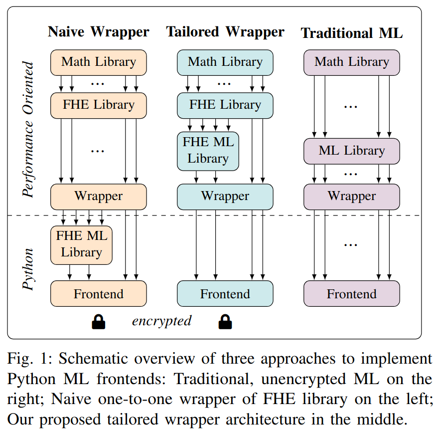
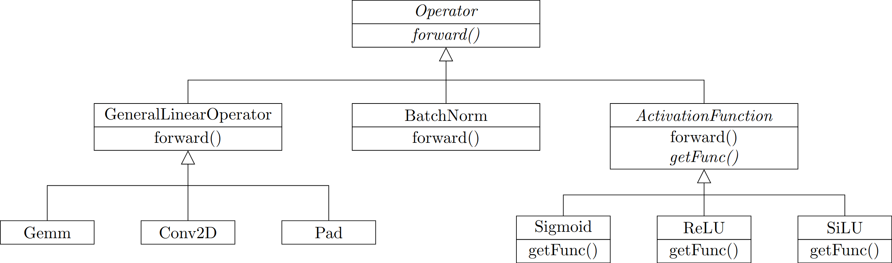

# he-man-openfhe


## TWA


## TWA Implementation


All operators inherit from an `Operator` class, where the `forward` method corresponds to applying the operation on a ciphertext. This `Operator` class has a private static member in the form of a context object, giving the connection to the CKKS environment. The lower layer of abstraction then implements the linear operators, activation functions, and batch normalization.
### Activation Function
The activation functions are implemented in the `ActivationFunction` class. OpenFHE provides a method for evaluating polynomials, where the parameters are fitted using Chebyshev approximation. This is done by providing an interval for the approximation and the polynomial degree $l$. The polynomial degree and the interval are both set by the model interaction. The interval of each activation function is deducted from a tuning process, where a set of inputs representing the real dataset is passed through the model giving a statistical overview of the values when an input is passed for activation function evaluation. An activation function object only stores these parameters and leaves the interval calculation to the model interaction.
### Linear Operators
Linear operators are derived from the `GeneralLinearOperator` class, which utilizes matrix multiplication to implement the `forward` method. The model interaction provides methods to derive the bias and transformation matrix out of a linear ONNX layer, which means that the linear operations in our implementation only need to take care of the multiplication and adding the bias. The model interaction packs the $m$-fold tensors by flattening them with row major order and in turn generates the transformation matrix accordingly.

It is worth mentioning that the `GeneralLinearOperator` class is not abstract, meaning that it can be instantiated and used. We still decided to implement another layer for each explicit operator. This was done for code readability and debugging since every object has a unique private identifier that contains class information.
### Matrix Multiplication
At the time of writing, OpenFHE does not include an implementation of matrix multiplication.
Therefore, we implemented the multiplication between a plaintext matrix $A$ and a ciphertext vector $\tilde{x}$ by using the babystep-giantstep method

## setup
- create a virtual env and activate it
- install [OpenFHEPy](https://anonymous.4open.science/r/OpenFHEPy-1234) into the virtual environment
- install project dependencies: `pip install .

## usage
run this command for an interactive help
```
he-man-openfhe --help
```

note:
all parameters defined in `config.py` can also be set by setting enviorment variables

### MNIST demo
This is a step-by-step manual to demonstrate the interface of `he-man-openfhe` by classifying MNIST images.<br/>
Input sample: `demo/mnist/input.npy`<br/>


**Step 0: Model Training (optional)**<br/>
Train an MNIST classifier by executing `scripts/train_mnist_model.py`. The resulting model will be saved at `demo/mnist/mnist.onnx`. This step is optional, as the repository contains a pre-trained model.

**Step 1: Keyparams Generation**<br/>
The model owner calls `keyparams` together with the model (`-m`) and a calibration-data container (zip/npz) (`-c`). The calibration-data is a set of sample inputs that is used to derive meta-data for the subsequent key generation. The keyparams are saved at the defined location (`-o`). Moreover, a calibrated model is generated and saved with the suffix `_calibrated` in the filename (i.e. `mnist.onnx` => `mnist_calibrated.onnx`). The calibrated model should be used for inference.
```
he-man-openfhe keyparams -m demo/mnist/mnist.onnx -c demo/mnist/calibration-data.zip -o demo/mnist/keyparams.json
```

**Step 2: Key Generation**<br/>
The client generates the keys using the previously computed keyparams (`-i`). The resulting secret key is saved at the defined location (`-o`) together with the evaluation key whose filename is appended by `.pub`.
```
he-man-openfhe keygen -i demo/mnist/keyparams.json -o demo/mnist/key
```

**Step 3: Encryption**<br/>
The client encrypts input data using the key (`-k`) and the cleartext input (`-i`). The encrypted input is saved at the defined location (`-o`).
```
he-man-openfhe encrypt -k demo/mnist/key -i demo/mnist/input.npy -o demo/mnist/input.enc
```

**Step 4: Inference**<br/>
The model owner performs inference using the calibrated model (`-m`), the public evaluation key (`-k`) and the encrypted input (`-i`). The encrypted result is saved at the defined location (`-o`).
```
he-man-openfhe inference -m demo/mnist/mnist_calibrated.onnx -k demo/mnist/key.pub -i demo/mnist/input.enc -o demo/mnist/output.enc
```

**Step 5: Decryption**<br/>
The client decrypts the encrypted result (`-i`) using the secret key (`-k`). The cleartext result is saved at the defined location (`-o`).
```
he-man-openfhe decrypt -k demo/mnist/key -i demo/mnist/output.enc -o demo/mnist/output.npy
```

**Result:**<br/>
The result `output.npy` contains a numpy-array of length ten, where output neuron seven has the hightest output activation:<br/>
[-10.61485652  -1.41687503  -0.2596516    3.86985058  -4.38157674<br/>
  -7.26738544  -8.80905716  **12.59595965**  -0.35903776   7.6266054 ]

## development setup

- create a virtual env
- install project editable: `pip install -e ".[dev]"`
- install commit hooks: `pre-commit install`

### run all checks
```
pre-commit run --all-files
```
### run specific checks
```
pre-commit run --all-files [HOOK_ID]
```

check `.pre-commit-config.yaml` for `HOOK_ID`

## build
```
python -m build
```
wheels will be in `dist` folder

## test
run pytest using:
```
pre-commit run pytest
```
this will generate a test coverage report in `htmlcov`
